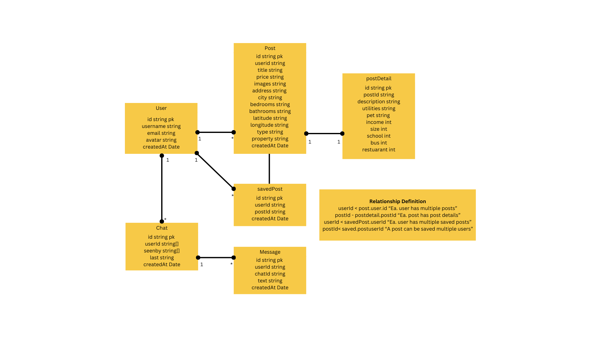

<h1 style="font-family: 'Arial';">Real Estate App MERN</h1>
Real Estate Application built using the MERN stack (MongoDB, Express.js, React, Node.js) with real-time chat functionality. This project demonstrates full-stack development and real-time communication between users, integrating modern technologies for a seamless user experience.

<h2 style="font-family: 'Arial';">Application Architecture</h2>

<h2 style="font-family: 'Arial';">Database Schema Diagram</h2>

